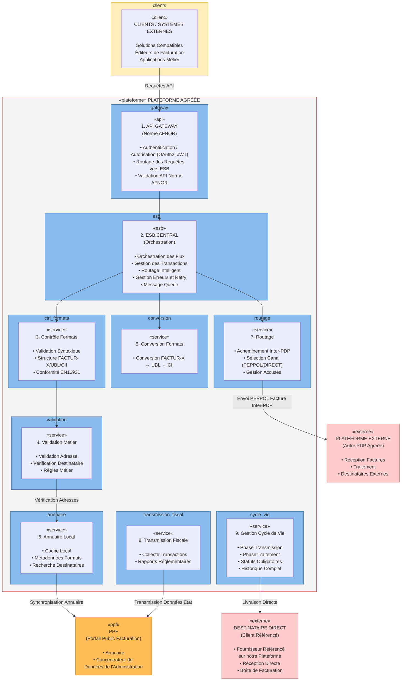

```mermaid
graph TD
    subgraph clients["clients"]
        CLIENT["«client»<br/>CLIENTS / SYSTÈMES EXTERNES<br/><br/>Solutions Compatibles<br/>Éditeurs de Facturation<br/>Applications Métier"]
    end

    subgraph plateforme["«plateforme» PLATEFORME AGRÉÉE"]
        subgraph gateway["gateway"]
            GW["«api»<br/>1. API GATEWAY<br/>(Norme AFNOR)<br/><br/>• Authentification / Autorisation (OAuth2, JWT)<br/>• Routage des Requêtes vers ESB<br/>• Validation API Norme AFNOR"]
        end

        subgraph esb["esb"]
            ESB["«esb»<br/>2. ESB CENTRAL<br/>(Orchestration)<br/><br/>• Orchestration des Flux<br/>• Gestion des Transactions<br/>• Routage Intelligent<br/>• Gestion Erreurs et Retry<br/>• Message Queue"]
        end

        subgraph ctrl_formats["ctrl_formats"]
            CF["«service»<br/>3. Contrôle Formats<br/><br/>• Validation Syntaxique<br/>• Structure FACTUR-X/UBL/CII<br/>• Conformité EN16931"]
        end

        subgraph validation["validation"]
            VAL["«service»<br/>4. Validation Métier<br/><br/>• Validation Adresse<br/>• Vérification Destinataire<br/>• Règles Métier"]
        end

        subgraph conversion["conversion"]
            CONV["«service»<br/>5. Conversion Formats<br/><br/>• Conversion FACTUR-X ↔ UBL ↔ CII"]
        end

        subgraph annuaire["annuaire"]
            ANN["«service»<br/>6. Annuaire Local<br/><br/>• Cache Local<br/>• Métadonnées Formats<br/>• Recherche Destinataires"]
        end

        subgraph routage["routage"]
            ROUT["«service»<br/>7. Routage<br/><br/>• Acheminement Inter-PDP<br/>• Sélection Canal (PEPPOL/DIRECT)<br/>• Gestion Accusés"]
        end

        subgraph transmission_fiscal["transmission_fiscal"]
            TF["«service»<br/>8. Transmission Fiscale<br/><br/>• Collecte Transactions<br/>• Rapports Réglementaires"]
        end

        subgraph cycle_vie["cycle_vie"]
            CV["«service»<br/>9. Gestion Cycle de Vie<br/><br/>• Phase Transmission<br/>• Phase Traitement<br/>• Statuts Obligatoires<br/>• Historique Complet"]
        end
    end

    PPF["«ppf»<br/>PPF<br/>(Portail Public Facturation)<br/><br/>• Annuaire<br/>• Concentrateur de Données de l'Administration"]

    DEST["«externe»<br/>DESTINATAIRE DIRECT<br/>(Client Référencé)<br/><br/>• Fournisseur Référencé sur notre Plateforme<br/>• Réception Directe<br/>• Boîte de Facturation"]

    PDP_EXT["«externe»<br/>PLATEFORME EXTERNE<br/>(Autre PDP Agréée)<br/><br/>• Réception Factures<br/>• Traitement<br/>• Destinataires Externes"]

    CLIENT -->|"Requêtes API"| GW
    GW --> ESB
    ESB --> CF
    ESB --> CONV
    ESB --> ROUT
    CF --> VAL
    VAL -->|"Vérification Adresses"| ANN
    ANN -->|"Synchronisation Annuaire"| PPF
    TF -->|"Transmission Données État"| PPF
    CV -->|"Livraison Directe"| DEST
    ROUT -->|"Envoi PEPPOL Facture Inter-PDP"| PDP_EXT

    style clients fill:#FFEEBB,stroke:#CC9900
    style plateforme fill:#f5f5f5,stroke:#CC3333
    style gateway fill:#88BBEE,stroke:#336699
    style esb fill:#88BBEE,stroke:#336699
    style ctrl_formats fill:#88BBEE,stroke:#336699
    style validation fill:#88BBEE,stroke:#336699
    style conversion fill:#88BBEE,stroke:#336699
    style annuaire fill:#88BBEE,stroke:#336699
    style routage fill:#88BBEE,stroke:#336699
    style transmission_fiscal fill:#88BBEE,stroke:#336699
    style cycle_vie fill:#88BBEE,stroke:#336699
    style PPF fill:#FFBB55,stroke:#CC8800
    style DEST fill:#FFCCCC,stroke:#CC6666
    style PDP_EXT fill:#FFCCCC,stroke:#CC6666
```