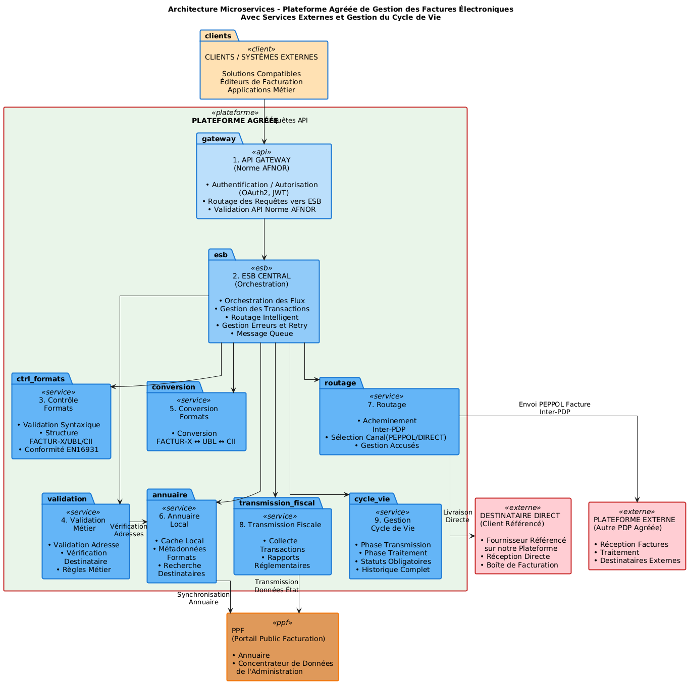
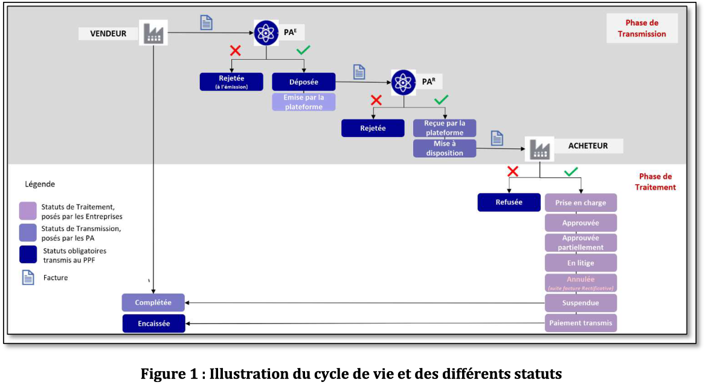
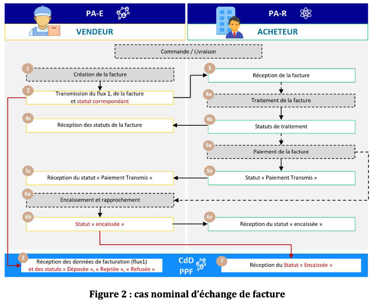
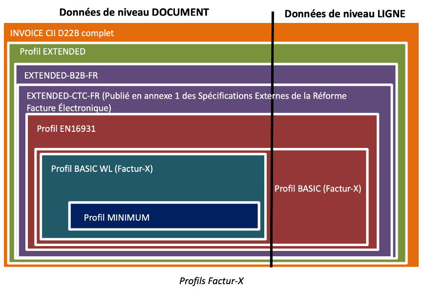

# Onboarding contributeur — Construction PA

> Février 2026

## Parcours d'onboarding : `./docs/00_onboarding`

**Tronc commun :**
1. Contexte et vision du projet
2. Architecture : les 10 briques
3. Les normes de référence
4. Organisation du dépôt
5. Stratégie BDD

**Parcours DEV :**
7. Installation environnement
8. Le code : packages et services
9. Implémenter un test BDD

**Parcours MÉTIER :**
6. Rédiger un scénario BDD
12. Focus par brique

**Finalisation commune :**
10. Rapports de tests
11. Contribuer

> Renvoi vers une documentation du repo : `./<rep>/<document>`

---

## Bloc 1 — [TOUS] Contexte et vision du projet

### La réforme facturation électronique

**Qu'est-ce qu'une PA — Plateforme Agréée** (anciennement PDP - Plateforme de Dématérialisation Partenaire) ?

- Point d'entrée obligatoire pour émettre/recevoir des factures électroniques
- Positionnement vis-à-vis du PPF (Portail Public de Facturation)

**Calendrier de la réforme :**

- Sept. 2026 : obligation de réception pour toutes les entreprises
- 2027 : obligation d'émission (échelonné par taille)
- 3 obligations : réception, émission, e-reporting (transmission fiscale)

### Vision PA Communautaire

**Trajectoire du projet PDP Libre :**

- Choix d'une PA partenaire pour septembre 2026
- En parallèle : construction d'une PA Communautaire open source

**Valeurs fondamentales :**

- **Open source** : code ouvert, licences libres (GPL-3.0-or-later)
- **Souveraineté** : indépendance vis-à-vis des acteurs commerciaux
- **Communautaire** : gouvernance participative et transparente
- **Sans but lucratif** : au service de l'intérêt général

Écosystème : émetteur, destinataire, PA émettrice/réceptrice, PPF, DGFiP.

Ce projet open source est porté par des bénévoles avec comme objectif d'accompagnement pour les contributeurs, l'acquisition de compétences dans la facturation électronique. L'objectif cible est de produire tout ou partie du code d'une Plateforme Agréée candidat à être exploité par l'association PDP Libre ou toute entité qui le déciderait.

### Parcours d'une facture (vue simplifiée)

1. L'émetteur dépose une facture sur sa PDP
2. La PDP contrôle le format (UBL, CII, Factur-X)
3. La PDP valide les règles métier
4. La PDP route la facture vers la PA du destinataire (via PEPPOL dans certains cas)
5. Le destinataire reçoit la facture et gère son cycle de vie
6. Les données fiscales sont transmises à l'État (e-reporting)

> Ressources : `./README.md`, forum <https://forum.pdplibre.org/>

---

## Bloc 2 — [TOUS] Architecture fonctionnelle

### Vue d'ensemble



### Les 10 briques

| # | Brique | Description |
|---|--------|-------------|
| 01 | API Gateway (FastAPI) | Point d'entrée REST, norme XP Z12-013 |
| 02 | ESB Central (NATS) | Orchestration des flux, message queue |
| 03 | Contrôle Formats | Validation UBL / CII / Factur-X |
| 04 | Validation Métier | Règles métier, vérification destinataire |
| 05 | Conversion Formats | Conversion entre UBL, CII, Factur-X |
| 06 | Annuaire Local | Cache local, synchronisation PPF |
| 07 | Routage (PEPPOL) | Acheminement inter-PDP |
| 08 | Transmission Fiscale | E-reporting vers l'État |
| 09 | Gestion Cycle de Vie | Statuts : déposée, reçue, approuvée… |
| 10 | Stockage (S3 / SeaweedFS) | Persistance des fichiers factures |

### Flux type d'une facture

1. Dépôt facture via API Gateway (01)
2. Publication sur l'ESB Central (02)
3. Contrôle du format (03) puis validation métier (04)
4. Conversion si nécessaire (05)
5. Consultation de l'annuaire (06) pour trouver le destinataire
6. Routage vers la PA destinataire via PEPPOL (07)
7. Transmission fiscale à l'État (08)
8. Gestion du cycle de vie et statuts (09)
9. Stockage des fichiers en S3 (10)

> Documentation par brique : `./docs/briques/<NN-nom>/README.md`

---

## Bloc 3 — [TOUS] Les normes de référence

### 3 normes AFNOR incluses dans le repo

**XP Z12-012 — Formats et cycle de vie**

- Formats : UBL, CII, Factur-X (EN16931)
- Profils de messages, règles métier, statuts de cycle de vie
- Annexe A (Excel) : règles métier, code lists, mappings
- Annexe B : exemples de factures et statuts

**XP Z12-013 — API REST**

- Swagger en annexe (Flow Service, Directory Service)
- Routes : `/healthcheck`, `/flows`, `/directory-line`, `/search`…

**XP Z12-014 — Cas d'usage B2B**

- UC1 à UC5 avec exemples XML complets
- Scénarios nominaux et d'erreur

> `./docs/norme/index.md` — Fichiers PDF, XSD et exemples XML dans `./docs/norme/` — **Commencer par là**

### XP Z12-014 — Cas d'usage B2B





Autres cas documentés :

- Rejet à l'émission d'une facture e-invoicing
- Facture Déposée NON_TRANSMISE pour absence de PA-R
- Rejet d'une facture en réception
- Refus d'une facture par l'ACHETEUR (Destinataire de la facture)
- Facture en litige, suivie d'un AVOIR partiel ou total
- Facture en litige, suivie d'une Facture Rectificative

### Autres références

- **CDAR D22B (UN/CEFACT)** — Cross Domain Acknowledgement and Response. Format des accusés de réception entre PDP.
- **BRS - CDAError Acknowledgement Process** — Processus de gestion des erreurs d'accusé.
- **Standard FACTUR-X 1.07.3** (2025-05-15) — Disponible sur le site de la [FNFE](https://fnfe-mpe.org/).



---

## Bloc 4 — [TOUS] Organisation du dépôt

### Structure du monorepo

Un seul référentiel pour tous les projets.

```
./docs/
  briques/         → doc + .feature par brique
  développement/   → guides dev, BDD, install
  norme/           → normes AFNOR et annexes
  test/            → exemples BDD commentés

./packages/          → un sous-répertoire par « projet »
  pac0/            → implémentation de référence
  pac-bdd/         → moteur de tests BDD
  pac0-cli/        → CLI utilitaire (pilotage de la PA)

./docker/
  docker-compose   → (sera déplacé à la racine)
  Dockerfiles      → 10 services + test-bdd

./report/            → rapports de tests (HTML, MD, XML)

./script/            → scripts utilitaires (./script/test)
```

**Dépôts :**

- **GitHub** : releases publiques
- **Forgejo** : développement quotidien

---

## Bloc 5 — [TOUS] Stratégie BDD

> Le « Behavior Driven Development », ou BDD, est une méthode de développement Agile dans laquelle le produit est conçu autour du comportement qu'un utilisateur s'attend à expérimenter. Le principe du BDD est donc de préciser un « comportement désiré ».

### Le BDD : un langage commun

- **Behavior Driven Development** : spécifications exécutables
- Langage commun entre métier et développeur
- Vision communautaire : outils de tests pour les éditeurs de logiciels métier et de PA

**La boucle « Trois Amigos » :** Expert métier + Développeur + Testeur

**Gherkin en français :** `Fonctionnalité`, `Scénario`, `Soit`, `Quand`, `Alors`

**Cycle de vie d'un test :**

1. Rédaction par l'expert métier (`.feature`)
2. Implémentation par le développeur (step definitions)
3. Exécution automatique (`pytest-bdd`)

### Lien feature → steps → système

- Fichiers `.feature` dans `./docs/briques/<NN-nom>/`
  - Rédigés en Gherkin français par les experts métier
- Code des steps dans `packages/pac-bdd/src/pac_bdd/`
  - `api.py`, `peppol.py`, `service.py`, `esb.py`…
- Le moteur `pytest-bdd` fait le lien :
  - Lit une étape Gherkin (ex : `Quand j'appelle l'API GET /healthcheck`)
  - Cherche le step definition correspondant
  - Exécute la fonction Python associée

> Rapports : `./report/pac-bdd/`
>
> Ressources : `./docs/developpement/BDD_README.md`, `./docs/developpement/BDD_Guide_Developpeur.md`, `./docs/developpement/BDD_Guide_Expert_Metier.md`

---

## Bloc 6 — [MÉTIER] Rédiger un scénario BDD

### Structure d'un fichier `.feature`

- **Entête obligatoire** : `# language: fr`
- **Fonctionnalité** : titre unique + description libre (peut référencer la norme, ex : Section 4.4 de XP_Z12-013.pdf)
- **Contexte** : étapes exécutées avant chaque scénario (`Soit une pa communautaire`)
- **Scénario** : un cas de test concret
  - `Soit` / `Étant donné` : précondition (Given)
  - `Quand` : action effectuée (When)
  - `Alors` : résultat attendu (Then)
  - `Et` / `Mais` : continuation

**Conventions du projet :**

- Variables entre guillemets : `"valeur"`
- Constantes préfixées : `#pa1`, `#accepted`

> Exemple : `./docs/briques/01-api-gateway/healthcheck.feature`

### Bonnes pratiques et anti-patterns

**Déclaratif, pas impératif :**

- ✅ `Quand Bob se connecte avec des identifiants valides`
- ❌ `Quand je saisis bob@test.com dans le champ email`

**Un scénario = un comportement (3-5 étapes)**

**Utiliser des valeurs concrètes :**

- ✅ `Alors l'identification par SIRET porte le code "0002"`
- ❌ `Alors l'identification est correcte`

**Anti-patterns à éviter :**

- Détails non essentiels (adresses, CB…)
- Logique conditionnelle (`si… alors…`) → 2 scénarios

Fonctionnalités avancées : Plan du Scénario, tableaux, Doc Strings, tags.

### Exemples concrets du projet

- **Healthcheck simple** (`./docs/briques/01-api-gateway/healthcheck.feature`) — Contexte + 2 scénarios courts, référence norme
- **Calculs PEPPOL** (`./docs/briques/07-routage/peppol.feature`) — Plusieurs scénarios avec valeurs concrètes
- **Communication inter-PA** (`./docs/briques/07-routage/pa_multiple.feature`) — Références `#pa1`, `#e1`, `#f1` — test bout en bout
- **Cycle de vie facture** (`./docs/briques/09-gestion-cycle-vie/facture.feature`) — Workflow asynchrone : dépôt puis interrogation

> Exercice : écrire un scénario pour la brique 05, 06 ou 08
>
> Ressources : `./docs/developpement/BDD_Guide_Expert_Metier.md`

---

## Bloc 7 — [DEV] Installation de l'environnement

### Accéder au repo

```bash
mkdir <repertoire_racine>
cd <repertoire_racine>
git clone https://git.pdplibre.org/Construction_PA/PA_Communautaire.git
cd PA_Communautaire
```

Accès navigateur : <https://git.pdplibre.org/Construction_PA/PA_Communautaire.git>

### Installer l'environnement : Docker vs Linux natif

**Avec Docker (recommandé) :**

- Prérequis : Docker / Podman
- `cd docker && docker compose up -d`
- 10 services + test-bdd en un seul compose
- Vérification : <http://localhost:8000/docs>
- Cible : branche `dev_docker_v2`

**Configuration S3 (stockage factures) :**

- Inclus dans le docker-compose (SeaweedFS)
- Port S3 : 8333

**Installation locale Linux :**

- Python 3.12+, `uv` (pas pip !)
- `curl -LsSf https://astral.sh/uv/install.sh | sh`
- `uv sync` dans chaque package

**NATS Server (broker de messages) :**

- Télécharger et installer `nats-server`
- Optionnel : `nats-cli` pour le debug

**Lancement séquentiel des services :**

1. `nats-server -V -js`
2. `uv run fastapi dev ...` (API Gateway)
3. `uv run faststream run ...` (services)

> `./docs/developpement/Installation_Linux.md`, `./docs/developpement/Installation_Docker.md`

### Vérification de l'installation

```bash
# Lancer les tests BDD
cd packages/pac-bdd && uv run pytest -v

# Lancer tous les tests avec rapport
./script/test

# Vérifier l'API Gateway
# http://localhost:8000/docs (interface Swagger FastAPI)
```

> Ressources : `docs/developpement/Installation_Docker.md`, `docs/developpement/Installation_Linux.md`, `docs/developpement/Configuration.md`

---

## Bloc 8 — [DEV] Le code : packages et services

### Conventions du code

- Python 3.12+ avec `async/await` partout
- Package manager : `uv` (jamais pip)
  - `uv sync` pour installer, `uv run` pour exécuter
- `pytest-asyncio` avec `asyncio_mode = "auto"`
- Licence GPL-3.0-or-later avec headers SPDX
- Chaque nouveau module de steps doit être importé dans `steps.py`

> Ressources : `packages/pac0/README.md`, `packages/pac-bdd/README.md`

---

## Bloc 9 — [DEV] Implémenter un test BDD

### Flux : `.feature` → step → système

1. **Identifier l'étape manquante** — `StepDefNotFound: "je vérifie le format UBL"`
2. **Choisir le bon module** — `api.py` (REST), `peppol.py` (routage), `service.py`, `esb.py`
3. **Écrire le step** :
   ```python
   @when(parsers.parse('j\'appelle l\'API {verb} {path}'))
   ```
   - `parsers.parse` pour les patterns simples
   - `parsers.re` pour les regex complexes
4. **Gérer Data Tables et Doc Strings** :
   - `datatable` : liste de dictionnaires
   - `docstring` : texte brut du bloc `"""..."""`

### Fixtures et exécution

- **WorldContext** : environnement multi-PA
  - `world1.pa1.api_gateway.get_client()` pour les appels API
- **Contexte local Pydantic** (`LocalTestCtx`) — Partage de données entre steps d'un scénario
- **Pattern async → sync** : `@async_to_sync`

**Exécution des tests :**

```bash
uv run pytest                                     # tous les tests
uv run pytest test_scenario.py::test_xxx -v        # un seul
uv run pytest -v -s --log-cli-level=DEBUG          # mode debug
uv run pytest --collect-only                       # collecter sans exécuter
```

> Ressources : `docs/developpement/BDD_Guide_Developpeur.md`

---

## Bloc 10 — [TOUS] Rapports de tests

### Lancer et lire les rapports

```bash
./script/test                                  # lancer tous les tests
cd packages/pac-bdd && uv run pytest           # lancer un package
```

**Rapports générés dans `./report/` :**

- `report/pac0/` : tests unitaires de l'implémentation
- `report/pac-bdd/` : tests BDD (scénarios Gherkin)

**3 formats de rapport :** HTML (visuel, navigable), Markdown (lisible en texte brut), XML JUnit (pour l'intégration continue).

**Interpréter un échec :**

- `StepDefNotFound` : step manquant (à implémenter)
- `AssertionError` : bug dans le code ou le scénario

---

## Bloc 11 — [TOUS] Contribuer

### Cycle de contribution

1. **Accès Forgejo** : demande d'invitation via le [forum](https://forum.pdplibre.org/)
2. **Fork + clone** du projet depuis Forgejo :
   ```bash
   git clone https://git.pdplibre.org/Construction_PA/PA_Communautaire.git
   ```
3. **Créer une branche thématique** : `feature/ma-fonctionnalite`, `fix/mon-correctif`
4. **Vérifier les tests** avant de commiter :
   ```bash
   cd packages/pac-bdd && uv run pytest -v
   ```
5. **Ouvrir une Pull Request** — toujours en lien avec une Issue, préfixe `WIP` tant que le travail est en cours
6. **Licence GPL-3.0-or-later**, headers SPDX obligatoires

---

## Bloc 12 — [MÉTIER] Focus par brique : écrire les tests

### Couverture actuelle (février 2026)

**Briques avec `.feature` existants (incomplets) :**

- 01-API Gateway : healthcheck, service, sha256, trackingId
- 02-ESB Central : healthcheck, esb, service, lifecycle, world
- 03-Contrôle Formats : format, service
- 04-Validation Métier : compliance
- 07-Routage : peppol, pa_multiple, peppol_live
- 09-Gestion Cycle Vie : facture, workflow, demo

**Briques à couvrir (prioritaires) :** 05-Conversion Formats, 06-Annuaire Local, 08-Transmission Fiscale, 10-Stockage.

**Méthode :**

1. Lire le README de la brique
2. Identifier la section de norme
3. Lister les comportements attendus
4. Rédiger les scénarios `.feature`

---

## Synthèse

### Récapitulatif des parcours

| Bloc | DEV | MÉTIER | Thème |
|------|:---:|:------:|-------|
| 1 — Contexte et vision | ✓ | ✓ | Pourquoi ce projet existe |
| 2 — Architecture 10 briques | ✓ | ✓ | Organisation du système |
| 3 — Normes de référence | ✓ | ✓ | Sur quoi on s'appuie |
| 4 — Organisation du dépôt | ✓ | ✓ | Où trouver quoi |
| 5 — Stratégie BDD | ✓ | ✓ | Comment on teste |
| 6 — Rédiger un scénario BDD | | ✓ | Écrire un .feature |
| 7 — Installation environnement | ✓ | | Mettre en place son poste |
| 8 — Le code : packages | ✓ | | Comprendre l'implémentation |
| 9 — Implémenter un test BDD | ✓ | | Coder les steps |
| 10 — Rapports de tests | ✓ | ✓ | Vérifier que ça marche |
| 11 — Contribuer | ✓ | ✓ | Pousser ses changements |
| 12 — Focus par brique | | ✓ | Couvrir le périmètre |

### Ressources et contacts

**Documentation :**

- `docs/developpement/Architecture.md` — Architecture technique
- `docs/developpement/Contribuer.md` — Guide de contribution
- `docs/developpement/BDD_Guide_Expert_Metier.md` — Guide BDD métier
- `docs/developpement/BDD_Guide_Developpeur.md` — Guide BDD dev
- `docs/norme/index.md` — Normes de référence

**Communauté :**

- Forum : <https://forum.pdplibre.org/>
- Forgejo : <https://git.pdplibre.org/Construction_PA/PA_Communautaire>
- GitHub : <https://github.com/PDP-Libre/PA_Communautaire>
- Visio bimensuelle

---

*Association à but non lucratif — [pdplibre.org](https://pdplibre.org) — contact@pdplibre.org*
