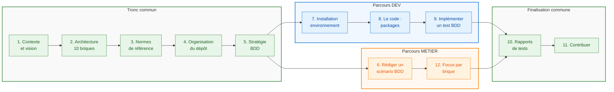

# Parcours d'onboarding - PA Communautaire

> Deux profils de contributeurs sont accueillis sur le projet :
> - **DEV** : Développeur avec compétences techniques générales
> - **METIER** : Expert métier en facturation électronique
>
> Chaque bloc est marqué selon le public visé : `[DEV]`, `[METIER]` ou `[TOUS]`.

## Parcours d'onboarding

**Légende** : 🟢 Tronc commun | 🔵 Parcours DEV | 🟠 Parcours METIER

---

## Bloc 1 - Contexte et vision du projet `[TOUS]`

- Qu'est-ce qu'une PDP ? Positionnement vis-à-vis du PPF et des autres PDP
- La réforme facturation électronique : calendrier sept. 2026 / 2027, obligations (réception, émission, e-reporting)
- Trajectoire du projet PDP Libre: choix d'une PA partenaire pour septembre 2026 et en parallèle construction d'une PA Communautaire
- Vision PA Communautaire : open source, souverain, sans but lucratif
- Les acteurs de l'écosystème : émetteur, destinataire, PDP émettrice, PDP réceptrice, PPF, DGFiP
- Parcours d'une facture de bout en bout (vue simplifiée)
- Ressources : `README.md`, forum https://forum.pdplibre.org/

---

## Bloc 2 - Architecture fonctionnelle : les 10 briques `[TOUS]`

- Vue d'ensemble : schéma d'architecture (`docs/00_onboarding/architecture_PA.md`)
- Rôle de chaque brique (présentation synthétique) :
  - 01-API Gateway : point d'entrée REST, norme AFNOR XP Z12-013
  - 02-ESB Central : orchestration des flux via NATS (JetStream)
  - 03-Contrôle Formats : validation syntaxique UBL / CII / Factur-X
  - 04-Validation Métier : règles métier, vérification destinataire
  - 05-Conversion Formats : conversion entre formats
  - 06-Annuaire Local : cache local, synchronisation PPF
  - 07-Routage : acheminement inter-PDP via PEPPOL
  - 08-Transmission Fiscale : e-reporting vers l'État
  - 09-Gestion Cycle de Vie : statuts obligatoires (déposée, reçue, approuvée...)
  - 10-Stockage : persistance fichiers via S3 (SeaweedFS)
- Flux type : dépôt facture -> contrôle -> validation -> routage -> cycle de vie
- Documentation par brique : `docs/briques/<NN-nom>/README.md`
- Ressources : `docs/developpement/Architecture.md`

---

## Bloc 3 - Les normes de référence `[TOUS]`

- Panorama des 3 normes AFNOR et leur périmètre :
  - XP Z12-012 : formats (UBL, CII, Factur-X), profils, cycle de vie, règles métier
  - XP Z12-013 : API REST (Swagger en annexe), healthcheck, flows, directory
  - XP Z12-014 : cas d'usage B2B (UC1 à UC5) avec exemples XML
- Le format CDAR (accusés de réception UN/CEFACT)
- Annexe A de XP Z12-012 (fichier Excel) : règles métier, code lists, mappings
- Annexe B : exemples de factures et statuts de cycle de vie
- Comment naviguer dans les normes : `docs/norme/index.md`
- Ressources : `docs/norme/`

---

## Bloc 4 - Organisation du dépôt `[TOUS]`

- Structure du monorepo :
  - `/docs` : documentation métier et développeur
  - `/docs/briques/` : documentation + fichiers `.feature` par brique
  - `/docs/developpement/` : guides installation, contribution, BDD
  - `/docs/norme/` : normes AFNOR et annexes
  - `/docs/test/` : exemples de tests BDD commentés
  - `/packages/pac0/` : implémentation de référence (9 microservices)
  - `/packages/pac-bdd/` : moteur d'exécution des tests BDD
  - `/docker/` : docker-compose et Dockerfiles pour la plateforme complète
  - `/report/` : rapports de tests générés (HTML, MD, XML)
  - `/script/` : scripts utilitaires (lancement des tests)
- Dépôts : GitHub (releases) vs Forgejo (développement quotidien)
- Ressources : `docs/developpement/Contribuer.md`

---

## Bloc 5 - Stratégie BDD : pourquoi et comment `[TOUS]`

- Pourquoi le BDD : langage commun entre métier et développeur, spécifications exécutables, vision communautaire du projet : apporter des outils de tests aux éditeurs de logiciels métier et de PA
- La boucle "Trois Amigos" : expert métier + développeur + testeur
- Gherkin en français : `Fonctionnalité`, `Scénario`, `Soit`, `Quand`, `Alors`
- Lien entre fichiers `.feature` (docs/briques) et code des steps (packages/pac-bdd)
- Cycle de vie d'un test : rédaction (métier) -> implémentation (dev) -> exécution automatique
- Rapports de couverture : `report/pac-bdd/`
- Ressources : `docs/developpement/BDD_README.md`

---

## Bloc 6 - Rédiger un scénario BDD `[METIER]`

- Structure d'un fichier `.feature` : entête `# language: fr`, Fonctionnalité, Contexte, Scénario
- Mots-clés Gherkin français et leur rôle
- Conventions du projet : variables entre `"..."`, constantes avec `#`
- Fonctionnalités avancées : Plan du Scénario, tableaux de données, Doc Strings, tags
- Bonnes pratiques : déclaratif vs impératif, un scénario = un comportement, 3-5 étapes
- Référencer les normes AFNOR dans la description de la Fonctionnalité
- Anti-patterns à éviter
- Exemples concrets du projet :
  - Healthcheck simple (`docs/briques/01-api-gateway/healthcheck.feature`)
  - Calculs PEPPOL (`docs/briques/07-routage/peppol.feature`)
  - Communication inter-PA (`docs/briques/07-routage/pa_multiple.feature`)
  - Cycle de vie facture (`docs/briques/09-gestion-cycle-vie/facture.feature`)
- Exercice : écrire un scénario pour une brique non couverte (05, 06, 08)
- Ressources : `docs/developpement/BDD_Guide_Expert_Metier.md`

---

## Bloc 7 - Installation de l'environnement `[DEV]`

- Prérequis : Git, Python 3.13+, uv (pas pip)
- Installation avec Docker (recommandé pour démarrer) :
  - `docker compose up` depuis `docker/` (cible : branche dev_docker_v2)
  - Vérification : http://localhost:8000/docs
  - Les 10 services + test-bdd dans un seul docker-compose
- Installation locale Linux :
  - Installation uv, NATS server, NATS CLI
  - `uv sync` dans chaque package
  - Lancement séquentiel des services
- Configuration S3 (stockage factures)
- Vérification de l'installation : lancer les tests
- Ressources : `docs/developpement/Installation_Docker.md`, `docs/developpement/Installation_Linux.md`

---

## Bloc 8 - Le code : packages et services `[DEV]`

- `packages/pac0/` : implémentation de référence
  - 1 service FastAPI (01-api-gateway)
  - 8 services FastStream (03 à 09) communicant via NATS
  - Structure d'un service : `src/pac0/service/<nom>/main.py`
  - Fixtures de test partagées : `src/pac0/shared/test/`
  - `WorldContext`, `PacServiceContext`, `NatsServiceContext`
- `packages/pac-bdd/` : moteur de tests BDD
  - Point d'entrée : `test_scenario.py` (charge tous les `.feature`)
  - Step definitions : `src/pac_bdd/` (api.py, peppol.py, service.py, esb.py...)
  - `steps.py` : import central de tous les modules de steps
- `packages/pac0-cli/` : CLI pour setup et lancement des services (`uvx pac0-cli@latest`)
- Conventions : async, SPDX headers, Python 3.13+
- Ressources : `packages/pac0/README.md`, `packages/pac-bdd/README.md`

---

## Bloc 9 - Implémenter un test BDD `[DEV]`

- Prérequis : avoir lu le guide expert métier
- Flux complet : `.feature` -> step definition -> système sous test
- Identifier une étape manquante (`StepDefNotFound`)
- Choisir le bon module (api.py, peppol.py, service.py, esb.py)
- Écrire un step : `@given`, `@when`, `@then` avec `parsers.parse` ou `parsers.re`
- Gérer Data Tables et Doc Strings
- Fixtures : `WorldContext` (multi-PA), contexte local Pydantic, contexte partagé par domaine
- Pattern async vers sync (`@async_to_sync`)
- Exécution des tests :
  - `cd packages/pac-bdd && uv run pytest`
  - Test unique : `uv run pytest test_scenario.py::test_xxx -v`
  - Mode debug : `-v -s --log-cli-level=DEBUG`
  - Collecte sans exécution : `--collect-only`
- Checklist avant PR
- Ressources : `docs/developpement/BDD_Guide_Developpeur.md`

---

## Bloc 10 - Lancer et lire les rapports de tests `[TOUS]`

- Lancer tous les tests : `./script/test`
- Lancer les tests d'un package : `cd packages/pac-bdd && uv run pytest`
- Lire le résumé : OK / KO par package
- Rapports générés dans `/report/` :
  - `report/pac0/` : tests unitaires de l'implémentation
  - `report/pac-bdd/` : tests BDD (scénarios Gherkin)
  - Formats : HTML (visuel), MD (lisible), XML JUnit (CI)
- Interpréter un échec : `StepDefNotFound` (step manquant) vs assertion (bug)
- Ressources : `docs/developpement/BDD_README.md`, `docs/test/index.md`

---

## Bloc 11 - Contribuer : workflow et bonnes pratiques `[TOUS]`

- Accès Forgejo : demande d'invitation via le forum
- Fork + clone du projet
- Créer une branche thématique (`feature/...`, `fix/...`)
- Vérifier les tests avant de commiter
- Ouvrir une Pull Request sur le dépôt principal toujours en lien avec une Issue, préfixe WIP
- Licence GPL-3.0-or-later, headers SPDX obligatoires
- Ressources : `docs/developpement/Contribuer.md`

---

## Bloc 12 - Focus par brique : écrire les tests `[METIER]`

- Pour chaque brique, connaître :
  - Le périmètre fonctionnel (README de la brique)
  - Les scénarios existants (fichiers `.feature`)
  - Les sections de norme de référence
  - Les cas d'usage couverts vs non couverts
- Briques prioritaires avec tests existants :
  - 01-API Gateway : healthcheck, service, sha256, trackingId
  - 02-ESB Central : healthcheck, esb, service, service_lifecycle, world
  - 03-Contrôle Formats : format, service
  - 04-Validation Métier : compliance
  - 07-Routage : peppol, pa_multiple, peppol_live
  - 09-Gestion Cycle de Vie : facture, workflow, demo
- Briques à couvrir (pas de `.feature` existant) :
  - 05-Conversion Formats
  - 06-Annuaire Local
  - 08-Transmission Fiscale
  - 10-Stockage
- Méthode : partir de la norme, identifier les comportements attendus, rédiger les scénarios
- Ressources : `docs/briques/`, `docs/norme/`

---

## Synthèse du parcours

| Bloc | DEV | METIER | Thème |
|------|:---:|:------:|-------|
| 1 - Contexte et vision | X | X | Pourquoi ce projet existe |
| 2 - Architecture 10 briques | X | X | Comment le système est organisé |
| 3 - Normes de référence | X | X | Sur quoi on s'appuie |
| 4 - Organisation du dépôt | X | X | Où trouver quoi |
| 5 - Stratégie BDD | X | X | Comment on teste |
| 6 - Rédiger un scénario BDD | | X | Écrire un .feature |
| 7 - Installation environnement | X | | Mettre en place son poste |
| 8 - Le code : packages | X | | Comprendre l'implémentation |
| 9 - Implémenter un test BDD | X | | Coder les steps |
| 10 - Rapports de tests | X | X | Vérifier que ça marche |
| 11 - Contribuer | X | X | Pousser ses changements |
| 12 - Focus par brique | | X | Couvrir le périmètre fonctionnel |
