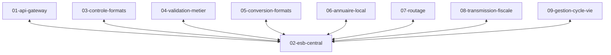

# Specs ESB central

Les briques communiquent via un [bus de message ESB](https://en.wikipedia.org/wiki/Enterprise_service_bus) centralisé.

Les briques ne peuvent communiquer entre elles directement.

Pour pouvoir communiquer chaque brique doit définir au moins un canal d'entrée.
Chaque message déposé sur ce canal déclenchera une action.
Le résultat est déposé sur un autre canal.
