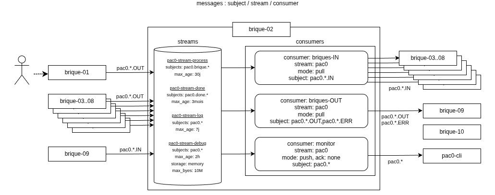

# persistence

Certain des messages doivent être persistés pour une durée plus longue que celle des messages en cours de traitement.

Pour définir ces politiques de conservation, nous avons besoin de la notion de **stream** et de **consumer**.

## streams

Voici les [streams](https://docs.nats.io/nats-concepts/jetstream/streams) à définir:
    - `pac0-stream-cold`: stream conservation longue pour 01-IN et 09-OUT
    - `pac0-stream-hot`: stream conservation moyenne pour les autres flux des briques
    - `pac0-stream-external`: stream conservation moyenne pour les appels externes (peppol, api fiscal, ...)
    - `pac0-stream-log`: stream éphémère pour les messages info/système (persistance activée pour les tests)
    - `pac0-stream-store`: stream pour les fichiers générés (avant stockage s3)

Avoir plusieurs **stream** distincts va permettre de mieux gérer les données et de les organiser en fonction de leur importance et de leur durée de conservation. Par exemple, les données sensibles ou les données à long terme peuvent être stockées dans un stream spécifique, tandis que les données temporaires ou les données de test peuvent être stockées dans un autre stream.

Le stockage à long terme est assuré par la brique **10-stockage** qui dispose également d'une notion de [persistence](/docs/briques/10-stockage/README.md#persistence).

TODO:
- durée de conservation à définir par stream
- fixer une taille maximale par stream ?

[Propriétés importantes](https://nats-io.github.io/nats.py/modules.html#nats.js.api.StreamConfig) d'un stream:
- `subjects`: list[str] | None = None, Subjects, used by stream to grab messages from them. Any message sent by NATS Core will be consumed by stream. Also, stream acknowledge message publisher with message, sent on reply subject of publisher. Can be single string or list of them. Dots separate tokens of subjects, every token may be matched with exact same token or wildcards.
- `max_age`: float | None = None,  TTL in seconds for messages. Since message arrive, TTL begun. As soon as TTL exceeds, message will be deleted.
- `storage`: Optional["StorageType"] = None, Storage type, disk or memory. Disk is more durable, memory is faster. Memory can be better choice for systems,
                where new value overrides previous.
- `deny_delete`: bool = False, Should delete command be blocked.
- `deny_purge`: bool = False, Should purge command be blocked.
- `declare`: bool = True, Whether to create stream automatically or just connect to it.
- `max_msg_size`: int | None = -1, Limit message size to be received. Note: the whole message can't be larger than NATS Core message limit.
- `max_bytes`: int | None = None, Max bytes of all messages to be stored in the stream. Stream can automatically delete old messages or stop receiving new messages, look for 'DiscardPolicy'.

## consumers

Voici les [consumers](https://docs.nats.io/nats-concepts/jetstream/consumers) à définir:
- `consumer flow` pour consommer les messages en suivant le flux normal (dispatch push, durable)
- `consumer status` pour pouvoir suivre l'avancement du flux normal (dispatch push, durable)
- `consumer status1` pour pouvoir suivre l'avancement du flux normal pour un seule facture (dispatch push, durable)
- `consumer test` pour pouvoir consulter les messages déjà consommés (dispatch pull, ordered, ephemeral)

Propriétés d'un consumer:
- [durable/ephemeral](https://docs.nats.io/nats-concepts/jetstream/consumers#persistence-durable-ephemeral))
- [ordered](https://docs.nats.io/nats-concepts/jetstream/consumers#ordered-consumers)
- [dispatch push/pull](https://docs.nats.io/nats-concepts/jetstream/consumers#dispatch-type-pull-push)

## sujets -> streams -> consumers

| subject                      | `stream-cold`     | `stream-hot`      | `stream-log`      |
|------------------------------|-------------------|-------------------|-------------------|
| `api-gateway-OUT`            |                   |                   |                   |
| `api-gateway-ERR`            |                   |                   |                   |
| `controle-formats-IN`        |                   |                   |                   |
| `controle-formats-OUT`       |                   |                   |                   |
| `controle-formats-ERR`       |                   |                   |                   |
| `validation-metier-IN`       |                   |                   |                   |
| `validation-metier-OUT`      |                   |                   |                   |
| `validation-metier-ERR`      |                   |                   |                   |
| `conversion-formats-IN`      |                   |                   |                   |
| `conversion-formats-OUT`     |                   |                   |                   |
| `conversion-formats-ERR`     |                   |                   |                   |
| `annuaire-local-IN`          |                   |                   |                   |
| `annuaire-local-OUT`         |                   |                   |                   |
| `annuaire-local-ERR`         |                   |                   |                   |
| `routage-IN`                 |                   |                   |                   |
| `routage-OUT`                |                   |                   |                   |
| `routage-ERR`                |                   |                   |                   |
| `transmission-fiscale-IN`    |                   |                   |                   |
| `transmission-fiscale-OUT`   |                   |                   |                   |
| `transmission-fiscale-ERR`   |                   |                   |                   |

*`pac0.` prefix removed
