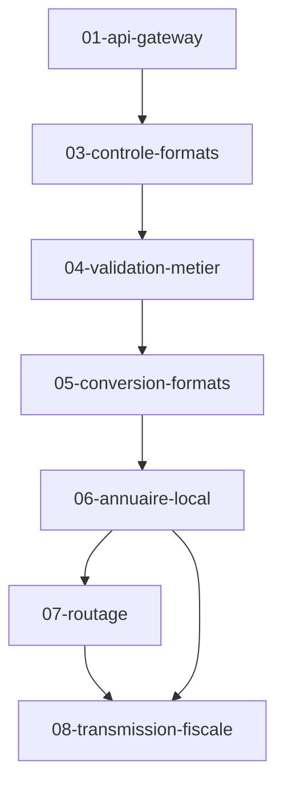

# Specs brique Gestion Cycle de Vie

La facture va circuler de brique en brique selon un cycle de vie déterminé dans cette brique.

```mermaid
flowchart TD
    01-api-gateway --> 03-controle-formats
    03-controle-formats --> 04-validation-metier
    04-validation-metier --> 05-conversion-formats 
    05-conversion-formats --> 06-annuaire-local
    06-annuaire-local --> 07-routage
    07-routage --> 08-transmission-fiscale
    06-annuaire-local --> 08-transmission-fiscale
    
```
## divers

Cf section 5 de XP_Z12-012.pdf

voir la norme CDAR

