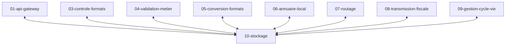

# Specs brique stockage

Le stockage persistant est assurée par la brique `10-stockage`.
Les autres briques ne stockent **rien** de façon permanente.
Elles sont **sans état** (stateless).
Pour enregistrer ou lire des données elles s'adressent au service de stockage:

Il y a donc 4 niveaux ou les données d'une facture résident:

1. **VOLATILE** : En mémoire ou sur le réseau pendant la traitement de chaque message par une brique (plusieurs minutes)
2. **TEMPORAIRE** : Sur le disque de chaque brique pendant la durée de vie de cette brique  (plusieurs heures)
3. **EN CACHE** : En stockage provisoire par la brique `02-esb-central` (plusieurs semaines)
4. **PERSISTANT** : En stockage permanent par la brique `10-stockage` (plusieurs années)
5. **ARCHIVE** : Avant le fin de vie des données, elles peuvent être déplacées vers un espace d'archivage (hors périmètre)

## chemin

- `<PACID>/<EID>/<CID>/<IID>/facturx.pdf` : facture au format factur-x
- `<PACID>/<EID>/<CID>/<IID>/ubl.xml` : facture au format UBL

## volume

La stockage peut être réparti sur plusieurs volumes (bucket dans la terminologie S3).

L'ensemble des données peut être stocké sur un seul volume
(approche initiale).
On pourra utiliser un volume dédié pour un ou plusieurs clients.

## TODO

* quels fichiers stocker ?
* stockage cloud
* hebergement souverain
* permettre un stockage chez le client
* estimer la volumetrie ?
* estimer le cout si cloud
* quel fournisseeur souverain ? scaleway ? OVH ? hetzner ?
* utiliser un hash pour une partie du chemin ? <PACID>, <EID>, <CID> ?
* chiffrer le contenu des fichiers stockés ? en option ?
* un même volume pour plusieurs pac ?