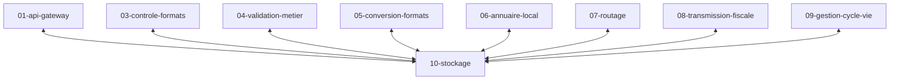

# Specs brique stockage

TODO:
* quels fichiers stocker ?
* stockage cloud
* hebergement souverain
* permettre un stockage chez le client
* estimer la volumetrie ?
* estimer le cout si cloud
* quel fournisseeur souverain ? scaleway ? OVH ? hetzner ?