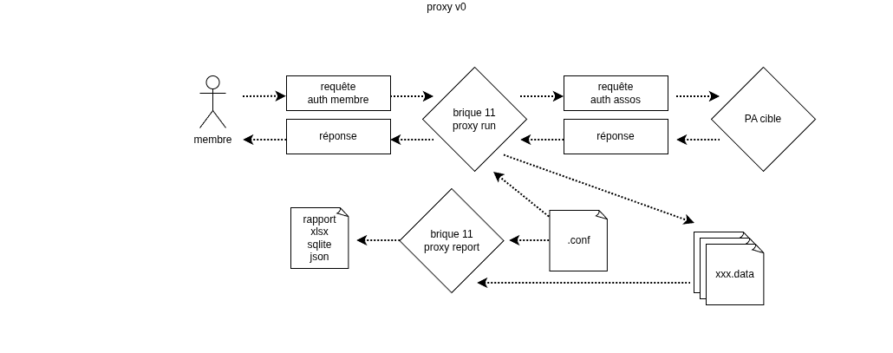
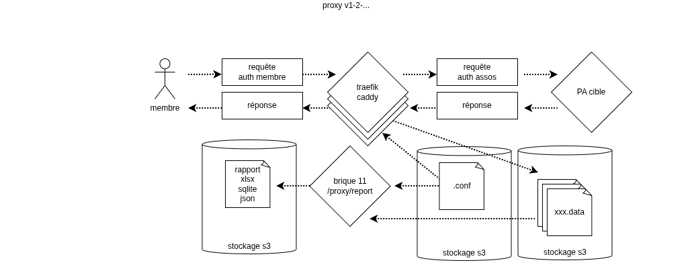
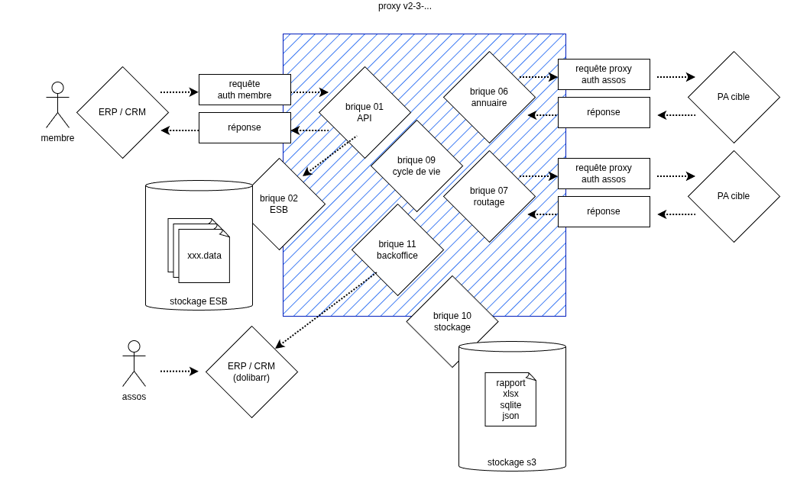

# Brique 11 proxy / backoffice

Vocabulaire:
- **proxy** : nom du projet courant visant à regrouper et décompter les flux de plusieurs **membres** vers un seul **PA**
- **membres** : membre de l'**association** qui vont utiliser le **proxy** pour la gestion de leur facturation
- **association** : association PDP Libre (ou tout autre entité souhaitant aggréger l'usage d'un **PA** unique)
- **PA** : Plateforme Agréé qui va recevoir les appels API du **proxy**

Cette brique proxy sera plus tard la brique backoffice chargée de la gestion des utilisateurs. Les fonctionnalités de proxy seront alors intégrées directement à la brique API.

## Swagger / OpenAPI

L’API du proxy doit respecter le SWAGGER décrit dans l’Annexe A de la norme XP_Z12-013.pdf.
Le proxy va considérer **tous** les appels API comme des appels API au PA **sauf** ceux utiles à la gestion du proxy.

Les tests utilisés pour vérifier le bon comportement d'un PA doivent pouvoir être utilisés avec le proxy.

Des tests dédiés aux fonctionnalités du proxy seront réalisés: gestion des membres, authorisation, 

## v0 / v1 / v2

On distingue 3 jalons pour la réalisation de ce projet:
- v0 **contrainte faisabilité** : réaliser sous 8 jours une preuve de concept (POV) pour valider le concept et la cible fonctionnelle de la v1
- v1 **contrainte déploiement** : déploiement au plus tard en septembre 2026, objectifs de sécurité
- v2 **contrainte stabilité** : objectifs de volumétrie




Architecture v0 de base:
- stockage des fichiers sur le serveur
- génération du rapport via un CLI et des fichiers locaux




Possibilité évolution architecture v1/v2/... :
- stockage durable S3 pour la collecte
- stockage durable S3 pour les rapports
- purge automatique via politique S3
- proxy haute performance pour la partie collecte : traefik, caddy
- possibilité load balancing / HA de la partie collecte
- serveurs stateless




- Utiliser aux max les briques existantes
- brique11 normalement inutile ... qui pourrait plutôt faire le backoffice (gestion utilisateurs, décompte, ...)
- Appels API via brique01 (API) qui fonctionne en synchrone: elle poste sur brique02 et attends la réponse avant de répondre au **membre**
  - authentification de l'appel ...
- Transfert vers brique09 (cycle de vie) qui *transmets* à brique07 (routage)
- Traitement par la brique07
  - appele le PA cible (mode proxy) et dépose la réponse dans la brique02
- brique09 transfert le message vers brique01
- brique01 réponds à la requête initial du **membre**

Plus tard (chaque mois):
- Appel à fréquence fixe (tous les mopis) à la brique11 pour *facturer*
  - interroger une fois par mois la brique02
  - actualiser le décompte (utile à la facturation)
  - stocker dans une base *locale* à la brique le décompte 
  - webhook pour informer le système amont de facturation de l'**assos* (Dolibarr par exemple)
  
## Authentification amont

**Cible v0:** appels non authentifiés en substitution

**Cible v1:**

L'authentification amont concerne les appels API des **membres** de l'**association**.
Chaque **membre** diposera de sa clé API qu'il fournira à chaque requête au proxy.
La clé API est un token JWT à chiffrement asymétrique.
Le proxy disposera de la clé publique pour vérifier l'authenticité des tokens.

Si le jeton est validé, l'appel est authentifié. Le jeton du **PA** est substitué au jeton du **membre** et l'appel est relayé au **PA**.

**Cible v2:**

Permettre de générer de nouveaux jetons JWT en indiquant:
- la clé privé principale (qui ne sera jamais conservée par le **proxy**)
- la durée de validité
- le scope (non utilisé pour le moment)
- le siren du **membre** (facultatif): mets-à-jour la conf automatiquement

## Authentification aval

Cible: v0

L'authentification aval concerne les appels API du **proxy** vers le **PA**.
Il s'agit d'une clé API sous forme d'un token JWT.
Cette clé sera utilisé par le **proxy** dans chaque requête API relayée au **PA**.

## Routes

### Route * (*)

**Cible v0** Toutes les routes non pré-définies sont captées, authentifiées et relayées par le proxy.


### Route /proxy/manage/report  (POST)

**Cible >=v2:** Pour générer un rapport.


### Route /proxy/manage/access (POST)

**Cible >=v2:** Pour ajouter/modifier un accès membre


### Route /proxy/metrics (GET)

**Cible v2:** Affiche les métriques courantes du proxy


### Route /proxy/reload (POST)

**Cible  v1:** Ordonne la recharge de la configuration du proxy.
Toutes nouvelles requête sera traitée avec la nouvelle configuration.


## stockage conf

**Cible v0:** La conf est un fichier stocké sur le serveur **proxy**.
Les valeurs sensibles (secrets) sont fixées par variables d'environnement.

**Cible v1:** La conf est un fichier stocké sur un bucket s3 distant. L'URL d'accès à ce bucket est un URL pré-signé placé dans une variable d'environnement.


## stockage traffic

Pour chaque requête et sa réponse, on crée un fichier.

**Cible v0:** Le traffic relayé par le proxy est stocké dans des fichiers locaux.

**Cible v1:** Le traffic relayé par le proxy est stocké dans un bucket s3 distant. La politique du bucket assure la suppression automatiquement des fichiers après un durée définie.

**Cible v2:** Idem avec chiffrement des fichiers.


## stockage rapport

Le rapport d'activité est généré pour une période donnée.
Il s'agit normalement du mois calendaire passé.


**Cible v0:** Le rapport est généré localement

**Cible v1:** Le rapport généré est stocké dans un bucket s3 distant. La politique du bucket assure la suppression automatiquement des fichiers après un durée définie.

## CLI

**Cible v0:** Disposer d'une interface en ligne de commande pour gérer le proxy:

```shell
# lance le service API (brique 1) avec la configuration proxy dans `pac0.conf.yaml`
pac0 run 1
# génère les stats pour le mois en cours
pac0 backoffice report
```

**Cible v2:**

```shell
# clé/secret pour accéder au proxy
export PAC0_PROXY_URL=https://proxy.pac0.pdplibre.org
export PAC0_PROXY_KEY=xxxxxxxxx
# génère les stats pour le mois en cours
pac0 proxy report
# génère les stats pour une période donnée
pac0 proxy report 20260312 20260324
```

## Console

Cible: v2

Disposer d'un suivi simple de l'activité du proxy:
- nombre de requête
- distribution durée des requêtes
- volume stockage
- infos des derniers appels: SIREN, numéro facture, ...

## conf

Fichier de configuration du **proxy**:

Cible: v0
```yaml
# Fichier `pac0_proxy.conf.yaml` dans le répertoire local
$schema: https://pdplibre.org/schema/conf/0
proxy:
  enabled: true
  port: 8080
  upstream:
    endpoint: https://api.pdplibre.fr
    # secret envar à fixer PAC0_PROXY__UPSTREAM__API_KEY  
    # api_key: XXXXXX
  store:
    backend: file
    path: /var/pac0/proxy/store/
  
```

Cible: v1
```yaml
# Fichier `pac0_proxy.conf.yaml` dans le répertoire local
$schema: https://pdplibre.org/schema/proxy/0
port: 8080
upstream:
  endpoint: https://api.pdplibre.fr
  # secret envar à fixer PAC0_PROXY__UPSTREAM__API_KEY
  #api_key: XXXXXX
store:
  backend: s3
  endpoint: https://s3.mon-fournisseur.fr
  bucket: xxxxx
  region: fr-par
  access_key: xxxxxxxxxxxx
  # secret envar à fixer PAC0_PROXY__STORE__SECRET_KEY
  #secret_key: xxxxxxxxxxxx
report:
  backend: s3
  endpoint: https://s3.mon-fournisseur.fr
  bucket: xxxxx
  region: fr-par
  access_key: xxxxxxxxxxxx
  # secret envar à fixer PAC0_PROXY__REPORT__SECRET_KEY
  #secret_key: xxxxxxxxxxxx
access:
  - siren: '55555555'
    jwt_pub: 'xxxxxxxxxxxxxxxxxxxxxxxxxxxxxxxxxxxxxxx'
  - siren: '11111111'
    jwt_pub: 'xxxxxxxxxxxxxxxxxxxxxxxxxxxxxxxxxxxxxxx'
  - siren: '33333333'
    jwt_pub: 'xxxxxxxxxxxxxxxxxxxxxxxxxxxxxxxxxxxxxxx'
```

Cible: v2
```yaml
# Ordre de recherche de la conf (premier trouvé):
# - Variable d'environnement PAC0_PROXY_CONF
# - Argument ligne de commande `__conf`
# - Fichier `pac0_proxy.conf.yaml` dans `~/.conf/pac0/`
# - Fichier `pac0_proxy.conf.yaml` dans `/etc/pac0/`
# - Fichier `pac0_proxy.conf.yaml` dans le répertoire courant
$schema: https://pdplibre.org/schema/proxy/2
# ...
```

## Tests

Il faut ré-utiliser les tests PA du projet.
Il faut prévoir un mécanisme pour lancer ces tests sur une PA avec ou sans proxy.
Le résultat des tests consistant à comparer si les tests avec/sans proxy ont le même résultat/

## Sécurité

Idéalement, le proxy ne devrait rien conserver:
- ne rien conserver localement: utiliser un stockage externalisée de type S3 pouvant offrir les garanties nécessaires
- ne rien conserver indéfiniement: utiliser un mécanisme de purge automatique des données après un délai à configurer

Le proxy doit présenter une surface d'attaque la plus réduite possible.
D'où l'idée que la génération des rapports soit externe (sous forme d'un CLI qui n'a pas besoin d'être présent sur le serveur).
Ce qui permets de réduire les droits du proxy qui ne pourrait qu'ajouter des données sans pouvoir lire les données déjà collectées.

On peut même envisager un chiffrement des données stockées.

Prévoir aussi un rate limit par **membre**.


## Webhook

**Cible v0:** Non supporté

**Cible v2:** si le weebhook ne passent pas par le proxy, ils peuvent fonctionner sans modification du proxy ?

# Déploiement

- déploiement instance dev
- déploiement instance test (même cible que prod)
- déploiement instance prod
- metriques (prom metrics ?)
- certificat SSL : derrière un proxy pour terminer le lien HTTPS, ou via caddy


# Volumetrie

Estimation volumétrie, durée de rétention


## divers

Voir également les [notes initiales](notes_202603) et le [compte-rendu de la réunion du 31 mars 2026](notes_20260331).
